# Vivaldi Startpage Custom Widgets

 

A curated collection of aesthetic, lightweight, and interactive custom webpage widgets designed specifically for the **Vivaldi Browser Start Page Dashboard**.

[Live Demo Showroom](https://kuzushiiii.github.io/Vivaldi-Custom-Widgets/) • [Themes Overview](#themes-overview) • [Installation Guide](#installation-guide)

---

## Features

- **Interactive Showroom Dashboard**: Preview, filter, and test all widgets live at any tile size via the [Live Demo Showroom](https://kuzushiiii.github.io/Vivaldi-Custom-Widgets/) (or local `index.html`) without needing to install them first.
- **Thematic Immersion**: Authentic visual styles inspired by Persona 5 and Violet Evergarden.
- **CSS Container Queries**: Automatically scales typography, icons, and layouts gracefully across compact, wide, square, and banner tile dimensions.
- **Lightweight & Fast**: Built with vanilla HTML5, CSS3, and JavaScript with zero external frameworks.
- **Dynamic & Real-Time**: Live digital clocks, interactive calendars, day progress trackers, and real-time music playback visualizers.
- **Clean Vivaldi Integration**: Includes custom CSS to hide intrusive default widget titles while preserving full access to the 3-dots context menu on hover.
- **100% Local & Offline**: Runs directly from your local filesystem using the `file:///` protocol with bundled local WOFF2 web fonts (zero external font network requests).

---

## Interactive Showroom

> **Instant Live Preview:** Visit the [**Live Demo Showroom**](https://kuzushiiii.github.io/Vivaldi-Custom-Widgets/) (or open [`index.html`](index.html) locally) to interact with the entire collection in one unified dashboard!

- **Live Responsive Testing**: Scale widgets continuously or select standard Vivaldi tile presets (`1×1`, `2×1`, `2×2`, `3×2`) to see CSS Container Queries in action.
- **One-Click URL Copying**: Click `Copy Vivaldi URL` on any widget card to copy its URL for immediate pasting into Vivaldi Start Page.
- **Theme & Category Filtering**: Instantly filter between Persona 5 and Violet Evergarden widgets.

---

## Themes Overview

Explore the full interactive showcase in the [**Live Demo Showroom**](https://kuzushiiii.github.io/Vivaldi-Custom-Widgets/) (or [`index.html`](index.html)), or browse the available themes:

### Persona 5 Theme (`themes/persona-5/`)
- **Aesthetic:** High-contrast Phantom Thieves UI, comic book halftones, dynamic polygon masks, and jagged typography.
- **Available Widgets:**
  - *Calendar & Clock*: Comic digital clock with day phase and interactive month calendar.
  - *Day Progression*: Meta-Nav infiltration tracker measuring the passage of your 24-hour day.
  - *Song Viewer (Radio HUD)*: Real-time music status via Discord Lanyard or Last.fm (demo track: *"Life Will Change"*).
  - *Cut-In GIF Banners*: Dynamic animated character banners.

### Violet Evergarden Theme (`themes/violet-evergarden/`)
- **Aesthetic:** 19th-century Victorian postal stationery, wax seals, brass mechanical scales, textured parchment, and Bougainvillea motifs.
- **Available Widgets:**
  - *Auto Memory Doll Calendar*: Letterhead calendar with interactive memo dispatches, wax seal, and procedural paper rustle acoustics.
  - *Day Progression (Typewriter Carriage)*: Mechanical platen roller with dual-tone ribbon and midnight carriage return.
  - *CH Postal Phonograph (Song Viewer)*: Spinning vintage gramophone player with rotating brass tonearm (demo track: *"Sincerely"*).
  - *Atmospheric GIF Banners*: Subtle animated typing and floral banners.

---

## Installation Guide

### Step 1: Apply Vivaldi Custom CSS (Recommended)
To remove default white card backgrounds and title bars while keeping access to the 3-dots settings menu on hover:
1. Open `vivaldi://experiments` or `vivaldi://flags` in your Vivaldi address bar.

   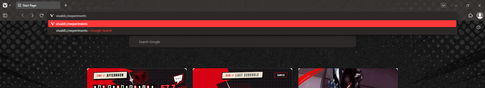

2. Search **"Allow CSS modifications"** on the search bar, enable it and then restart Vivaldi.

   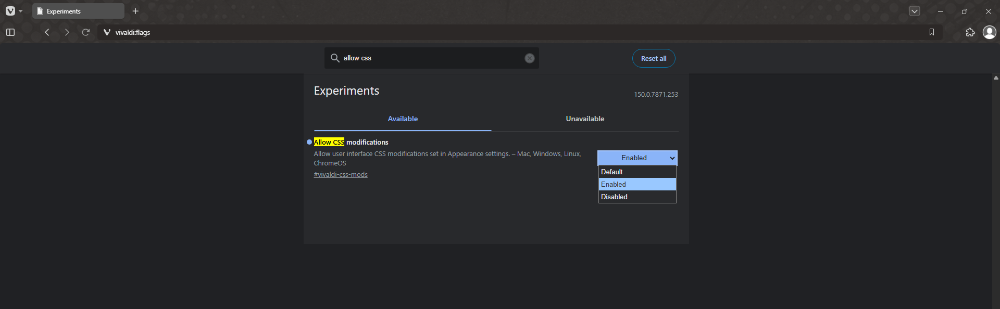

3. Open **Settings** (`Ctrl + F12`) > **Appearance** > scroll to **Custom UI Modifications**.

   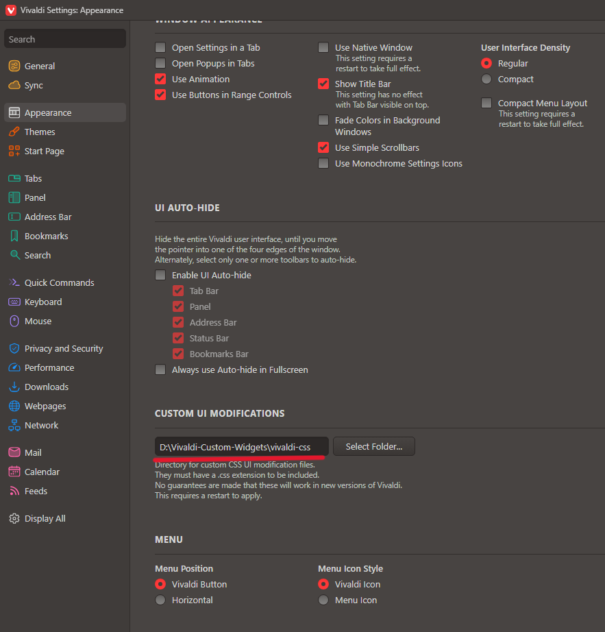

4. Click **Select Folder...** and select the `vivaldi-css` folder from this repository.

   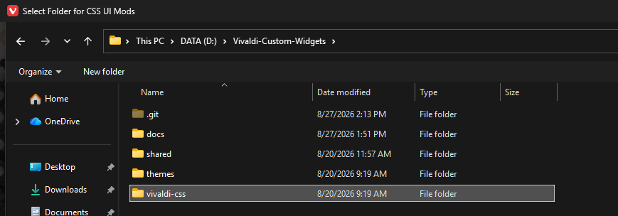

5. Restart Vivaldi, and then the white card backgrounds and the title bars should be removed, but the access to the 3-dots still exist on hover.

---

### Step 2: Add Widgets to Vivaldi Start Page

> **Quickest Method via Showroom:**  
> Open the [**Live Demo Showroom**](https://kuzushiiii.github.io/Vivaldi-Custom-Widgets/) (or local [`index.html`](index.html)) and click the **📋 Copy Vivaldi URL** button on any widget card to copy its exact URL directly, then jump straight to step 3 below!

**Manual Method:**
1. Open the widget file you want to use in Vivaldi:
   - Right-click the widget's `index.html` file (e.g. `themes/persona-5/calendar-widget/index.html`) > **Open with** > **Vivaldi**.

   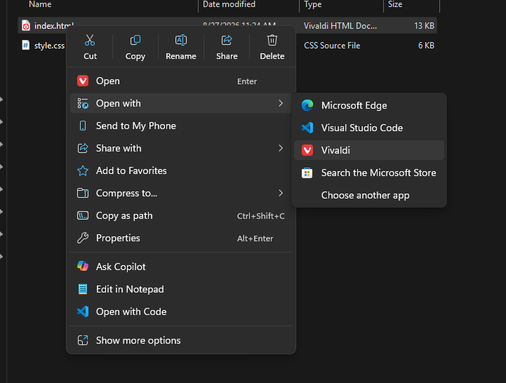

2. Copy the local file URL from the address bar (e.g. `file:///D:/Vivaldi-Widgets-Windows/themes/persona-5/calendar-widget/index.html`).

   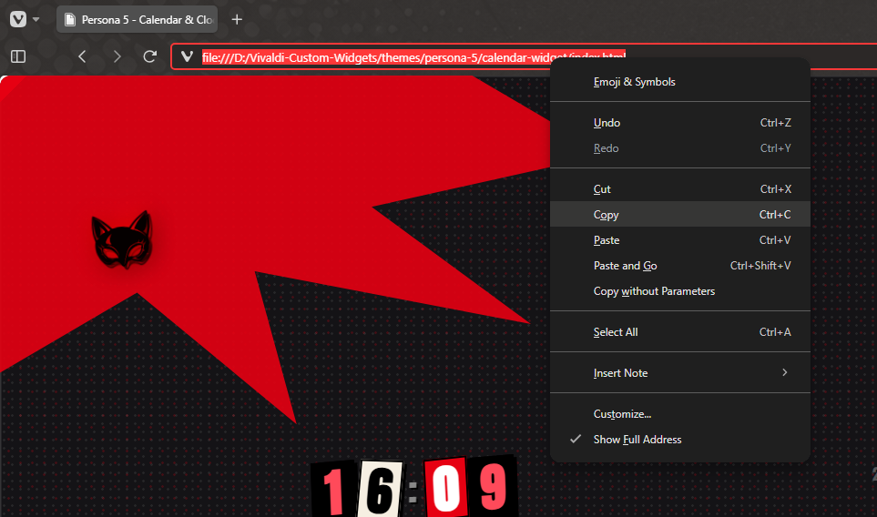

3. Open a **New Tab (Start Page)** in Vivaldi.
4. Add a new **Webpage** widget:
   - Paste the `file:///...` URL into the URL field.
   - Uncheck *Share Theme Colors* to retain the authentic widget styling.
   - Click **Done**.

   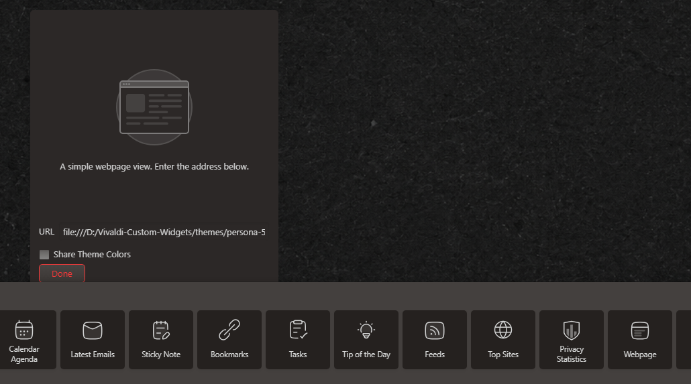 New widget -> Paste URL" width="600">

5. Resize and position the widget on your Start Page grid as desired.

   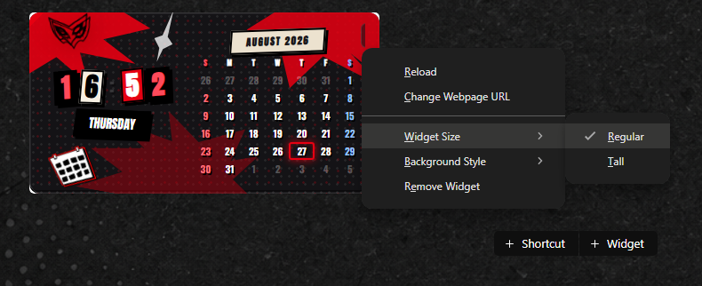

---

### Song Viewer Widget Setup

The Song Viewer widget displays your currently playing track in real-time. You can choose either **Discord (Lanyard)** or **Last.fm** as the data provider.

---

#### Option A: Discord (Lanyard API)

> **Prerequisite :** You must join the [Lanyard Discord Server](https://discord.gg/lanyard) first. The Lanyard API requires you to share a mutual server with their bot to read your activity status.

1. Connect your Spotify account to Discord (**Discord Settings > Connections > Spotify** and toggle *"Display Spotify as your status"*).

   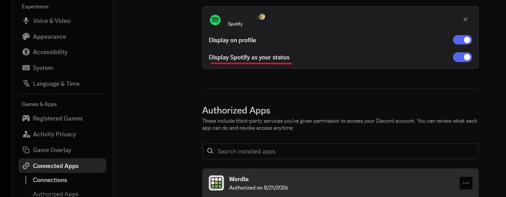

2. Get your Discord User ID (**Discord Settings > Developer > Enable Developer Mode** > open your profile > **Copy User ID**).

   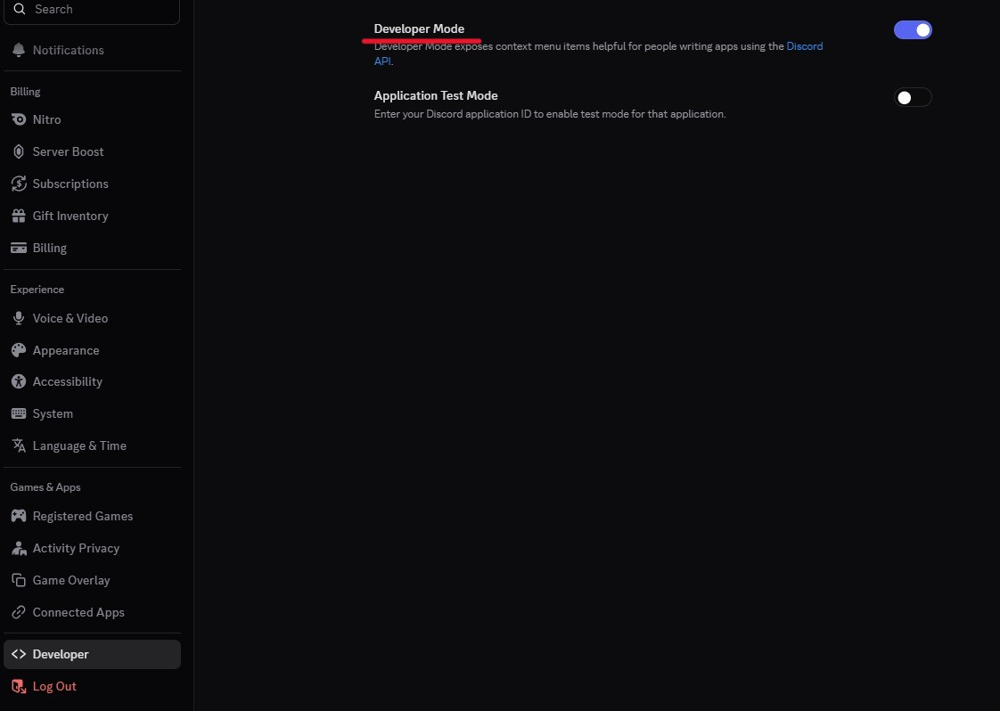

   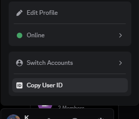

3. Click the **CONFIG** button on the widget, select the **DISCORD (LANYARD)** tab, paste your Discord User ID, and click **SAVE**.

   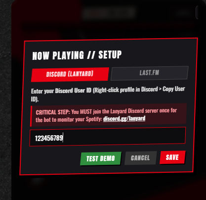

---

#### Option B: Last.fm (No Discord Required)

If you don't use Discord or prefer scrobbling, you can integrate via Last.fm:

1. Make **Last.fm** account if you dont have it in the first place  
2. Connect your Spotify account to Last.fm via [Last.fm Settings > Applications](https://www.last.fm/settings/applications) (under **Spotify Scrobbling**, click **Connect**).

   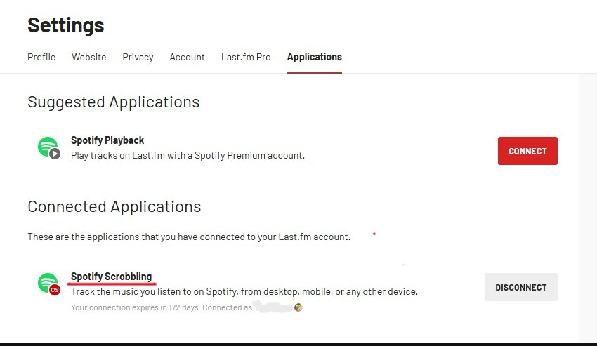

3. Click the **CONFIG** button on the top right in Song Viewer Widget in Vivaldi.
4. Switch to the **LAST.FM** tab.
5. Enter your **Last.fm Username**.

   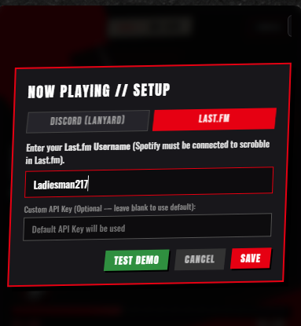

6. *(Optional)* Leave the **Custom API Key** field blank to use the built-in default API key, or provide your own from [Last.fm API Accounts](https://www.last.fm/api/account/create).
7. Click **SAVE**.

> ⚠️ **Important Note on Last.fm Experience:** 
> Unlike Discord (Lanyard) which uses real-time WebSockets and directly reads active desktop app states (instantly knowing when you pause, buffer, or play ads), Last.fm is a web-based scrobbling service. Because of this technical limitation:
> - The widget estimates track progression locally and may occasionally drift by a few seconds if your Spotify buffers, encounters lag, or plays Spotify Free ads.
> - The widget automatically resynchronizes to `00:00` as soon as the next track begins.

---

### Notes

For Calendar, Day Progression and the Gif widget i suggest resize it to regular and tall only for the Song Viewer widget, like mine :

   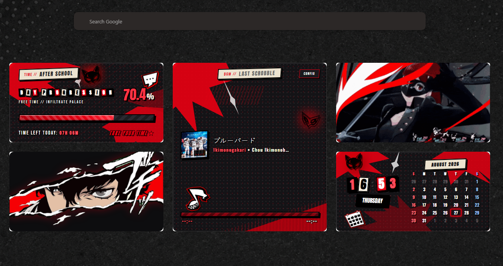

but keep in mind this is my personal preference soo you can resize & position it however you like xD, if its looks kinda lame you can just change the style in the css file

---

### License

Distributed under the [MIT](LICENSE) License. Feel free to use, modify, and customize for your own setup.
